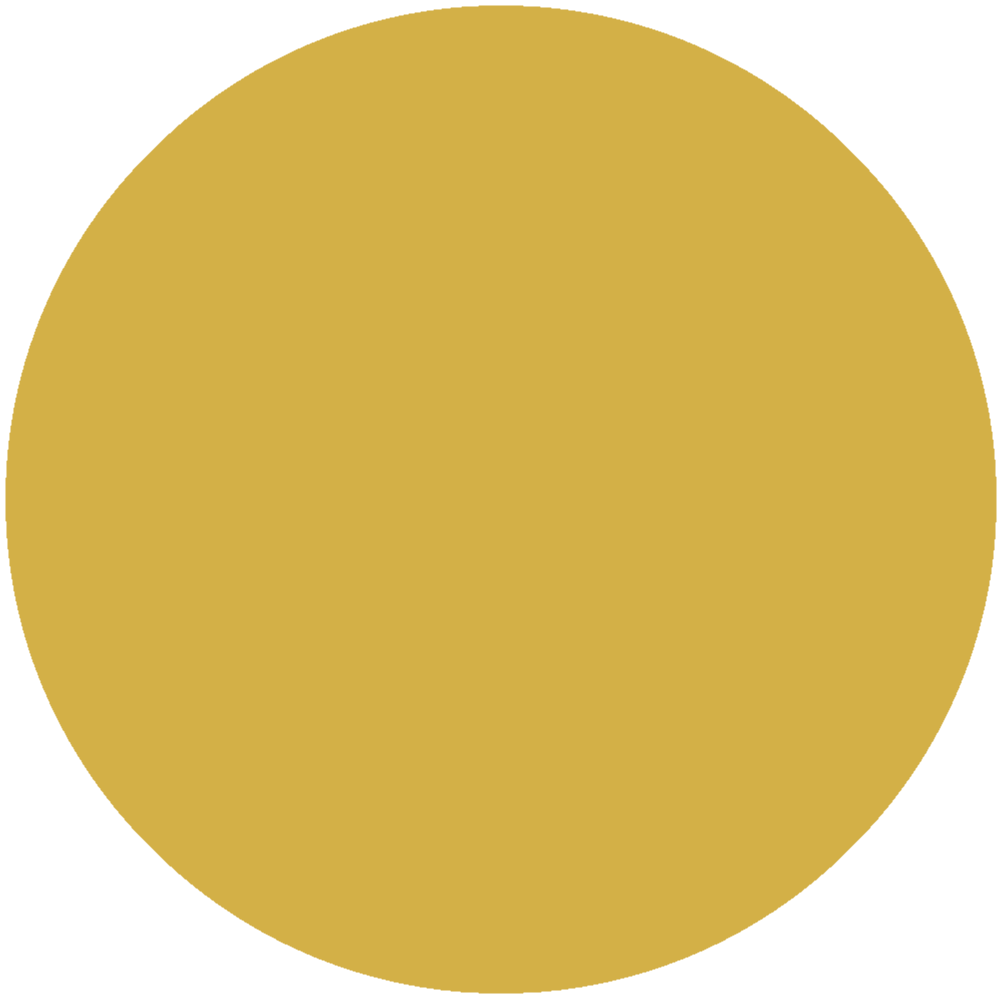
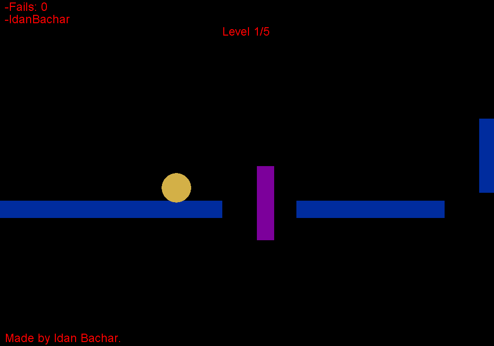
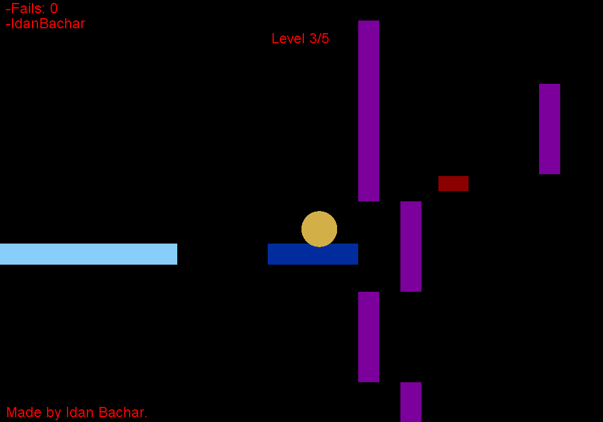
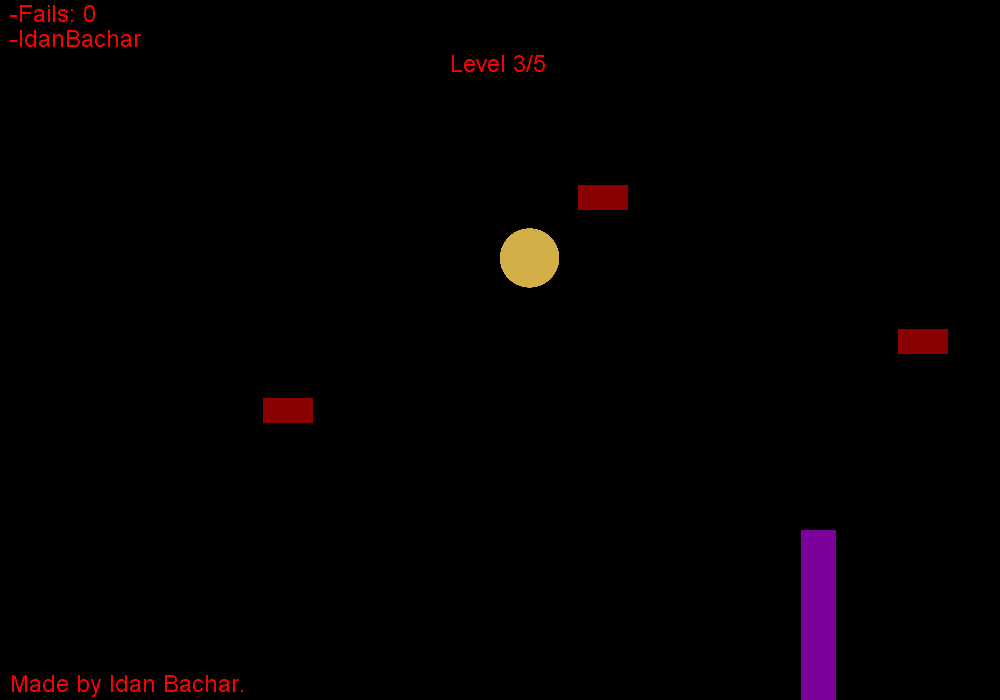
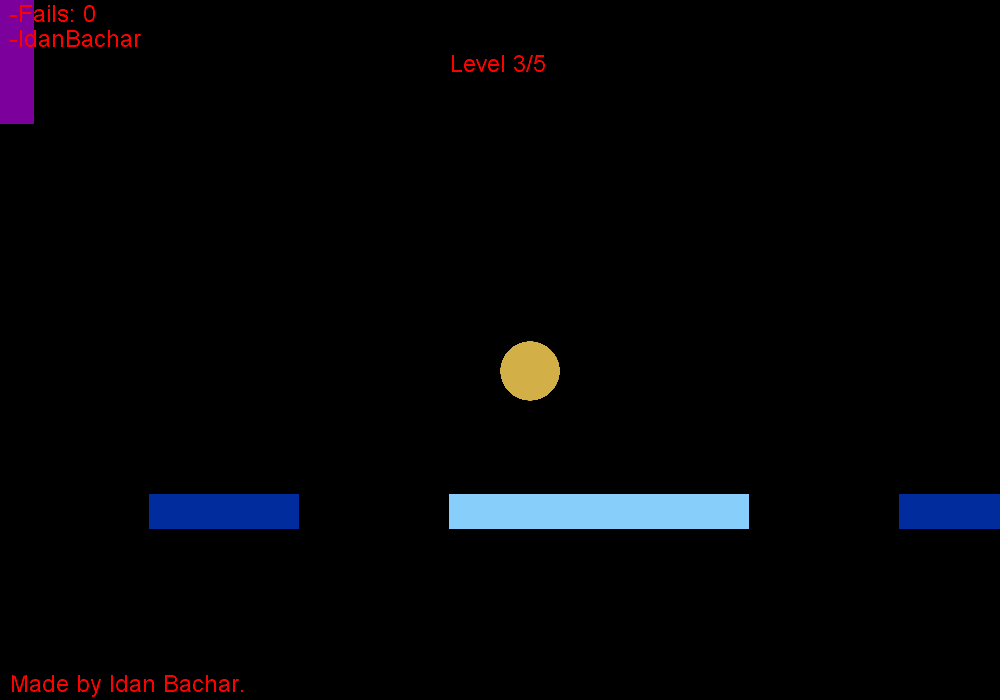
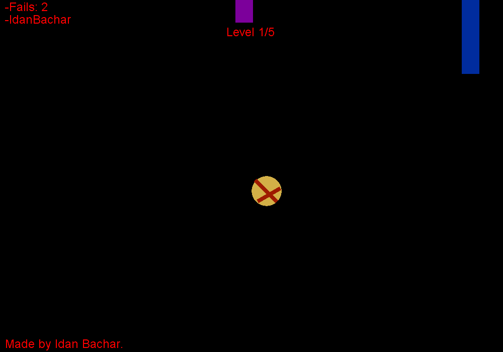
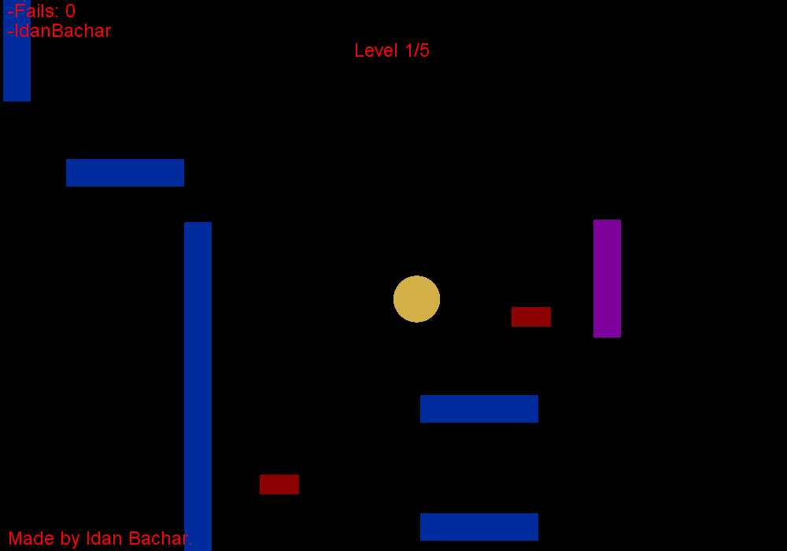

# Skatina

**Skatina** is a single player game where the main character is a ball in a retro graphics world full of deadly obstacles, touch will cause death, 5 challenging stages of increasing difficulty are waiting for you to beat.

   

## How to play?

### Character

This is you:

<table border="1" cellspacing="0">
 <tr>
  <th>Player Alive</th>
  <th>Player Dead (Most of the time :D)</th>
 </tr>
 <tr>
  <td>
   
  </td>
  <td>
   
  </td>
 </tr>
</table>

### Obstacles

The game contains Five difficulty scaled levels, with different types of obstacles:

1. **Purple Moving Floors**
2. **Red Bullets**

<table border="1" cellspacing="0">
 <tr>
  <th>Obstacle</th>
  <th>Description</th>
  <th>Image</th>
 </tr>
 <tr>
  <td>Purple Wall</td>
  <td>Stands and also moves. Kills the player immediately on collision.</td>
  <td>
   
  </td>
 </tr>
 <tr>
 	<td>Bullet</td>
  	<td>Shot from Purple walls. Very fast movement and Kills the player immediately on collision.</td>
  <td>
   
  </td>
 </tr>
</table>

### Objects

<table border="1" cellspacing="0">
 <tr>
  <th>Object</th>
  <th>Description</th>
  <th>Image</th>
 </tr>
 <tr>
  <td>Wall</td>
  <td>Stands and also moves. Blocks player movement on collision.</td>
  <td>
   
  </td>
 </tr>
 <tr>
 	<td>Floor</td>
  	<td>Without floor, you will fall.</td>
  <td>
   
  </td>
 </tr>
  <tr>
 	<td>Jumping Floor</td>
  	<td>Low gravity jump.</td>
  <td>
   
  </td>
 </tr>
   <tr>
 	<td>Finish Floor</td>
  	<td>Finish current level on player collision.</td>
  <td>
   
  </td>
 </tr>
</table>

### Gallery

<table border="1" cellspacing="0">
 <tr>
  <td>
   
  </td>
  <td>
   
  </td>
   <td>
   
  </td>
 </tr>
 <tr>
  <td>
   
  </td>
  <td>
   
  </td>
   <td>
   
  </td>
 </tr>
</table>
